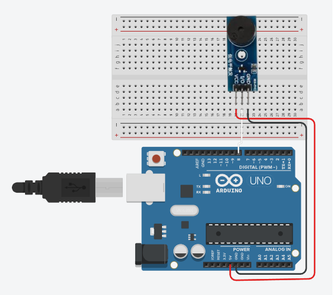

# ElectroScript 🚀

Projects from ElectroScript: Arduino, ecommerce systems and real-world development with Laravel.

---

## 🎵 Arduino Melodies

Recreating iconic songs using Arduino and a buzzer.

---

### 🔹 Blue Bird (Naruto Opening 3)

This project recreates the **Blue Bird melody from Naruto** using Arduino.

#### 📌 Includes:

* Arduino code (.ino)
* Pitches (notes)
* Circuit connection (buzzer wiring)

#### ⚡ Components:

* Arduino
* Passive buzzer
* Jumper wires
* Protoboard

#### 🔌 Connection:

* VCC → 5V
* GND → GND
* Signal → Pin 8 (or configured pin)

#### 🎥 Watch on YouTube:

https://youtube.com/shorts/x_wjLZFllCE

#### 📷 Circuit:

---

### 🔹 Doki Doki Literature Club

Recreation of a melody from **Doki Doki Literature Club** using Arduino and a buzzer.

#### 📌 Includes:

* Arduino code (.ino)
* Circuit connection

#### 🎥 Watch on YouTube:

https://youtube.com/shorts/42DYyWMsL6c

---

### 🔹 Gravity Falls

Recreation of the **Gravity Falls theme** using Arduino and a buzzer.

#### 📌 Includes:

* Arduino code (.ino)
* Circuit connection

#### 🎥 Watch on YouTube:

https://youtube.com/shorts/ipLiBA4L5gY

#### 📷 Circuit:

---

## 🎶 Available melodies

* Blue Bird (Naruto)
* Doki Doki Literature Club
* Gravity Falls

---

## 💡 About this project

This repository contains practical experiments combining:

* Electronics
* Programming
* Real-world development

---

## 🔥 More coming soon

* More Arduino melodies 🎶
* Ecommerce system with Laravel 🛒
* Automation and real-world features ⚙️

---

## 📢 Follow the journey

If you like this kind of projects, check the channel and follow the process of building real systems from scratch.
